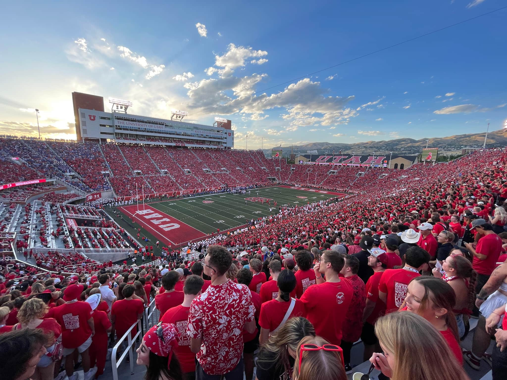

{: .no_toc }

## Table of contents
{: .no_toc .text-delta }

1. TOC
{:toc}

## Utah Football

The Utah Utes are an often nationally-ranked football program that plays in the PAC-12 Conference for the 23/24 season. Starting in 24/25 they will compete in the Big 12 Conference. They play in [Rice-Eccles Stadium](https://maps.app.goo.gl/BcgjFpzNXnSAC3Ky6), on the south end of campus.

Most games are televised but attending them as a student is an experience not to be missed. The Mighty Utah Student Section (MUSS) was [rated the #1 fan/student section in the US in 2021](https://twitter.com/TheMUSS/status/1469116997443092482) and general admissions tickets for students are free. Tickets are first-come first-serve and can can be found here: [utahtickets.com/muss](https://utahtickets.com/muss/). Students can also buy a "MUSS Pass" season ticket with guaranteed seating to all home football games. 

### 2023/24 Schedule
{: .no_toc}

|    Date     |     Opponent     |                                  Result                                  |
| :---------: | :--------------: | :----------------------------------------------------------------------: |
| Thu, Aug 31 |    vs Florida    | [W 24-11](https://www.espn.com/college-football/game/_/gameId/401520176) |
| Sat, Sep 9  |     @ Baylor     | [W 20-13](https://www.espn.com/college-football/game/_/gameId/401523999) |
| Sat, Sep 16 |  vs Weber State  | [W 31-7](https://www.espn.com/college-football/game/_/gameId/401524012)  |
| Sat, Sep 23 |     vs UCLA      | [W 14-7](https://www.espn.com/college-football/game/_/gameId/401524017)  |
| Fri, Sep 29 |  @ Oregon State  |                                                                          |
| Sat, Oct 14 |  vs California   |                                                                          |
| Sat, Oct 21 |      @ USC       |                                                                          |
| Sat, Oct 28 |    vs Oregon     |                                                                          |
| Sat, Nov 4  | vs Arizona State |                                                                          |
| Sat, Nov 11 |   @ Washington   |                                                                          |
| Sat, Nov 18 |    @ Arizona     |                                                                          |
| Sat, Nov 25 |   vs Colorado    |                                                                          |

## Utah Gymnastics

Utah has a nationally-recognized women's gymnastics team that regularly sends athletes to the Olympics. They compete in the [Huntsman Center](https://maps.app.goo.gl/DYtLngkiaZWj9M7X8).

Tickets must be reserved in advance but are free for students. [utahtickets.com/muss](https://utahtickets.com/muss/)

## Utah Basketball

The Mens and Women's basketball teams play in the [Huntsman Center](https://maps.app.goo.gl/DYtLngkiaZWj9M7X8).

To enter, students must show their UID at the Northwest doors. Tickets are not required in advance. 

## Other Local Sports Teams

### Real Salt Lake

Major League Soccer team. They play at [America First Field](https://maps.app.goo.gl/2Myk4FYwuZtu29qv7). Tickets are $20-50. The stadium is accessible via the Trax blue line. More info can be found on their website here [rsl.com](https://www.rsl.com/)

### Salt Lake Bees

Minor League baseball team, the Bees are the Triple-A affiliate of the [Los Angeles Angels](https://www.mlb.com/angels). They play at [Smith's Ballpark](https://maps.app.goo.gl/zpUmJsz3tEgJnsZp7). The stadium is accessible from campus via the Trax red line. Tickets are fairly inexpensive and sometimes free with Smith's grocery promotions. A fun summer activity. More info can be found on their website here: [milb.com/salt-lake](https://www.milb.com/salt-lake). 