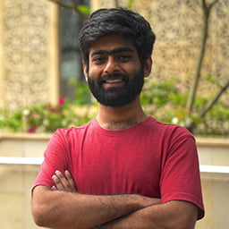
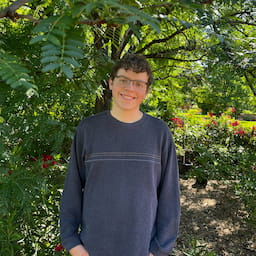
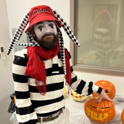

---
# Feel free to add content and custom Front Matter to this file.
# To modify the layout, see https://jekyllrb.com/docs/themes/#overriding-theme-defaults

layout: home
---

Welcome! The Graduate Student Advisory Committee (GradSAC) is a graduate student organization run by students for students. In a nutshell, our purpose is to improve the graduate student experience in the Kahlert School of Computing at the University of Utah. If you want to leave the nutshell and see a more in-depth explanation of what we do, check out our [constitution](https://drive.google.com/file/d/1quE9axBw747G0D-PY_Vi0XyriTN6xwJP/view)!

### Contact Info
To reach out to the current members of GradSAC, email us at [gradsac@cs.utah.edu](mailto:gradsac@cs.utah.edu), or post on the #gradsac channel of the Kahlert School of Computing Slack!
### Current Officers

#### Fall 2023 — Fall 2024

| Position                   | Person                                                 |                                                                                         |
| -------------------------- | ------------------------------------------------------ | :-------------------------------------------------------------------------------------: |
| President                  | Jakob Johnson ([email](mailto:jakob.johnson@utah.edu)) |      |
| Vice President             | Soham Bagchi ([email](mailto:soham.bagchi@utah.edu))   |      |
| Treasurer                  | Shreyas Singh                                          |  |
| New Student Facilitator    | Jarrett Minton                                         |  |
| Secretary                  | Chloe Pronovost                                        |      |
| Communications Coordinator | Ramansh Sharma                                         |      |
| Social Event Coordinator   | Benjamin Mastripolito                                  |          |

### Past Officers

#### Fall 2022 — Fall 2023

| Position                   | Person           |
| -------------------------- | ---------------- |
| President                  | Jakob Johnson    |
| Vice President             | Ahn Tran         |
| Secretary                  | Alper Sahistan   |
| New Student Facilitator    | Noelle Brown     |
| Communications Coordinator | Prikshit Tekta   |
| Social Event Coordinator   | Ben Mastripolito |

#### Fall 2021 — Fall 2022

| Position                   | Person           |
| -------------------------- | ---------------- |
| President                  | Noelle Brown     |
| Vice President             | Mahesh Lakshminarasimhan         |
| Treasurer                  | Madi Cooley        |
| Secretary                  | Shreyas Singh   |
| New Student Facilitator    | Yo Mizutani     |
| Communications Coordinator | [Devin Lange](https://www.devinlange.com/)   |
| Social Event Coordinator   | Ahn Tran |
| Social Event Coordinator   | Daniel Fang |

#### Fall 2020 — Fall 2021

| Position                   | Person           |
| -------------------------- | ---------------- |
| President                  | [Devin Lange](https://www.devinlange.com/)     |
| Vice President             | Mahesh Lakshminarasimhan         |
| Treasurer                  | Madi Cooley        |
| New Student Facilitator    | Frost Mitchell     |
| Communications Coordinator |  Anh Tran  |
| Social Event Coordinator   | Martin Matak |

